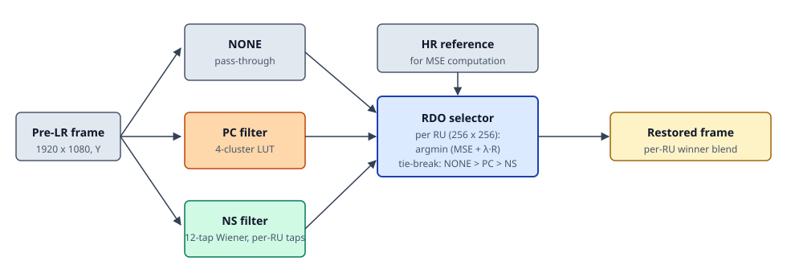

# AV2 Loop Restoration — FPGA Implementation

Hardware bring-up of the **loop-restoration** stage of the AV2 video codec on a Xilinx PYNQ-Z2
(Zynq-7020). The stage sits inside the codec's decoding loop and improves a coarsely
reconstructed frame by choosing, per 256×256 restoration unit (RU), one of three restoration
candidates and blending them back into the frame:

- **NONE** — leave the pre-loop-restored (pre-LR) pixels alone (no filter cost)
- **PC** — pixel-classification filter (4-cluster look-up, cheap)
- **NS** — non-separable Wiener filter (12 symmetric taps, per-RU trained)

An **RDO** (rate-distortion optimized) selector picks the winner per RU by minimizing
`cost = MSE + λ·R`, matching the AV2 reference behavior. All three filters and the RDO
selector run as custom AXI IPs on the PL side; a PYNQ Jupyter notebook drives the whole
pipeline from the PS side.

## Architecture



Each of the three candidates runs as its own IP on parallel AXI-DMA streams. The RDO IP
consumes all three (plus the HR reference for MSE), computes per-RU costs on-chip, and
emits a selection bitmap the host uses to blend the final frame.

## Results

Hardware-vs-software agreement, measured end-to-end on the board across the AV2 loop-restoration
test subset (5 sequences from paper Fig 4: CrowdRun, OldTownCross, PedestrianArea, Riverbed,
RushFieldCuts) at three quantization points:

| QP  | HW=SW selection | dPC     | dNS     | dCombined |
|-----|-----------------|---------|---------|-----------|
| 160 | 100.000 %       | +0.023  | +0.105  | **+0.094** |
| 170 | 100.000 %       | +0.015  | +0.088  | **+0.076** |
| 180 | 100.000 %       | +0.012  | +0.072  | **+0.062** |

`d*` columns are PSNR gain (dB) over pre-LR baseline, averaged across the 5 sequences.
"HW=SW selection" is per-RU winner agreement across all 28 RUs per frame — 100 % across
all 15 (sequence, QP) runs, i.e. bit-exact with the software golden model.

Rate-sweep behavior (same 15 frames, varying `λ·R_NS` charge — see [`rdo/rdo_notebook.ipynb`](rdo/rdo_notebook.ipynb)):

| Mode          | λ·R_NS   | NS wins / 28 | Blend gain |
|---------------|----------|--------------|------------|
| oracle        | 0        | 27.5         | +0.078 dB  |
| python-fair   | 8        | 27.5         | +0.078 dB  |
| heavy         | 10 000   | 23.5         | +0.076 dB  |
| very-heavy    | 50 000   | 9.7          | +0.054 dB  |

Confirms the RDO rate mechanism is live in hardware: raising the rate charge deselects NS in
favor of cheaper candidates and blend quality degrades gracefully — never below baseline.

## Layout

Each subdirectory is a self-contained Vivado 2025.2 project plus a PYNQ notebook that
validates it on real hardware.

| Path              | Contents                                                                          |
|-------------------|-----------------------------------------------------------------------------------|
| [`ns/`](ns/)      | NS filter — RTL, project, test-vector generators, HW validation notebook          |
| [`pc/`](pc/)      | PC filter — RTL, project, cluster/LUT hex data, HW validation notebook            |
| [`rdo/`](rdo/)    | RDO selector — RTL, project, end-to-end (train NS → PC-HW → NS-HW → RDO) notebook |
| [`ip_repo/`](ip_repo/) | Shared custom AXI IPs (`pc_axi_1_0`, `ns_filter_1_0`) referenced from `.xpr` files via `../ip_repo` |
| [`docs/`](docs/)  | Diagrams and reference material for this top-level README                         |

Per-module registers, DMA channel maps, and reproducibility notes live in each
subdirectory's own `README.md`.

## Quick start (reproduce a run)

1. **Clone.**
   ```bash
   git clone https://github.com/sukirti2004/av2-loop-restoration-fpga.git
   ```

2. **Copy a module's `<name>_filter_bd_wrapper/` folder onto the PYNQ-Z2 board** (via SCP
   or the Jupyter file browser). The folder holds `<name>_filter_bd_wrapper.bit` and
   `.hwh` — enough for PYNQ to load the overlay; you do NOT need Vivado on the board.

3. **Open the notebook** in the same folder as the wrapper (`ns_notebook.ipynb` /
   `pc_notebook.ipynb` / `rdo_notebook.ipynb`) and run all cells. The RDO notebook is
   the full end-to-end path: it trains per-RU NS taps in software, runs the PC and NS
   filters on hardware, feeds the four streams (HR, pre-LR, PC-HW, NS-HW) into the RDO
   IP, and reports per-RU HW-vs-SW agreement.

Test-vector generation (`gen_*.py`) and software golden models (`*_golden.py`) live next
to each notebook and can be re-run off-board with a plain Python + numpy install.

To rebuild a bitstream from source, open the module's `.xpr` in Vivado 2025.2 and re-run
synthesis + implementation + `write_bitstream`. Vivado's `.cache`, `.gen`, `.runs`,
`.sim`, `.hw`, `.ip_user_files`, and `.tmp` directories are ignored — they regenerate on
project open.

## Requirements

- **Hardware:** Xilinx PYNQ-Z2 (Zynq-7020) with PYNQ 3.0.1 image
- **Build:** Vivado 2025.2 (or compatible) for RTL synthesis and bitstream generation
- **On-board:** the `pynq` Python package (ships with the PYNQ image) and standard scientific
  Python (`numpy`, `matplotlib`) for the notebooks
- **Off-board (optional):** Python 3.10+ with `numpy` for the test-vector generators and
  golden-model scripts

## References

Descends from academic work on hardware-friendly non-separable Wiener filtering for AV1/AV2
loop restoration. The RTL, notebooks, and results in this repository are original work
performed on the PYNQ-Z2 platform.
